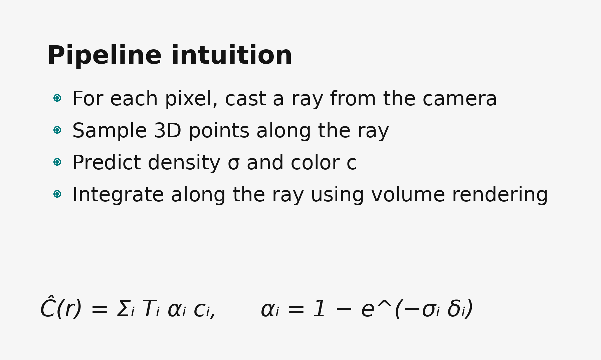
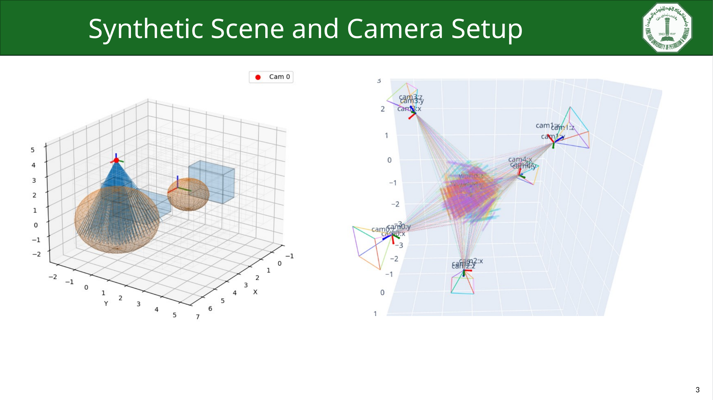
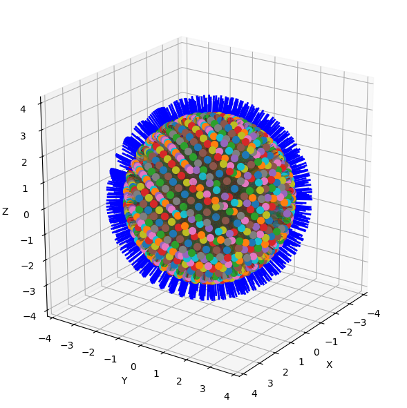
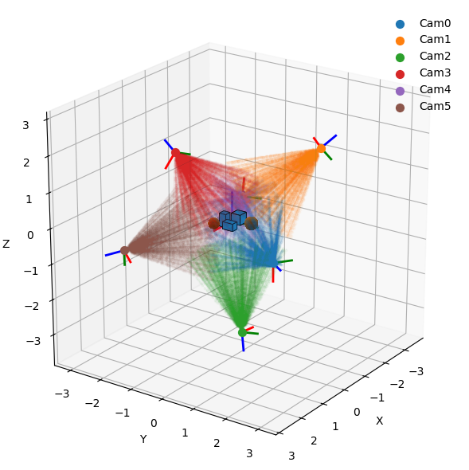
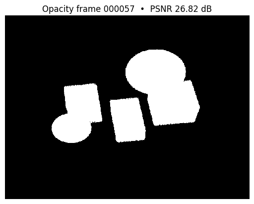
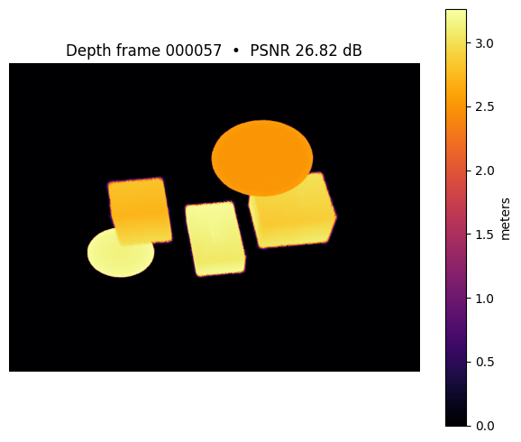
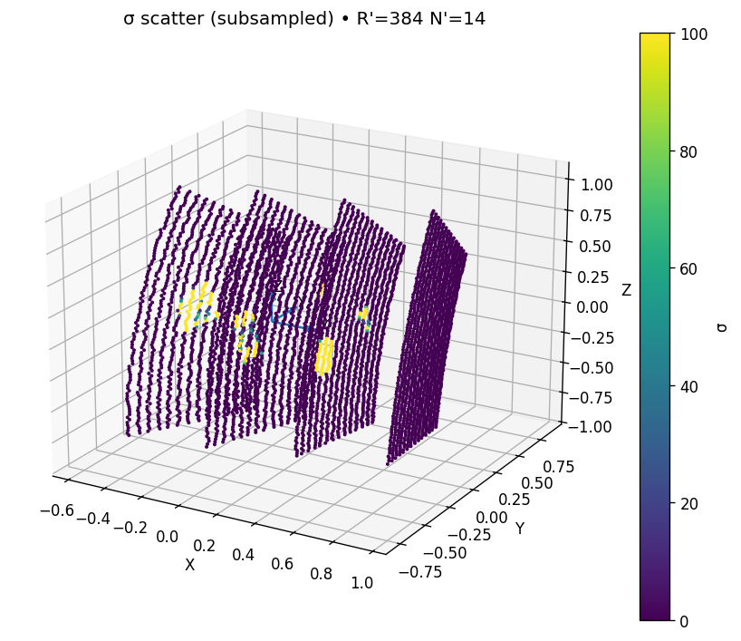
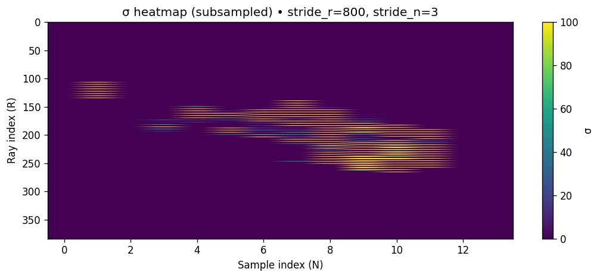

# NeRF Lab

NeRF-SLAM-oriented neural scene mapping lab for camera rays, pose-aware sampling, sigma-density learning, opacity/depth rendering, and robotics perception experiments.

`nerf-lab` is a public, course-scale implementation of the neural mapping/rendering layer behind NeRF-SLAM ideas. It supports my broader research direction in structure-aware planning and control for mobile manipulation by studying how camera poses, viewpoint coverage, and dense scene representations affect active perception and scanning.

## Project Snapshot

| Aspect | Summary |
|---|---|
| Role | Supporting perception layer for active perception, visual SLAM, view synthesis, and future world-model planning. |
| Implemented | Camera poses, ray generation, stratified sampling, sigma-density learning, opacity/depth rendering, training utilities, and notebook diagnostics. |
| Boundary | Course-scale mapping/rendering layer, not a complete online NeRF-SLAM stack. |
| Best entry points | `examples/`, `experiments/`, `nerflab/camera/`, and `nerflab/nerf_sigma_learning/`. |

## Visual Evidence

The figures below are real artifacts extracted from the project presentations and notebook outputs.

| Pipeline intuition | Synthetic scene and camera setup |
|---|---|
|  |  |

| Spherical camera coverage | Multi-pose ray sampling |
|---|---|
|  |  |

| Opacity render | Depth-style render |
|---|---|
|  |  |

| Sigma scatter diagnostic | Sigma heatmap diagnostic |
|---|---|
|  |  |

## Results Summary

The implementation works in controlled known-pose settings and exposes the expected gap to full NeRF-SLAM when poses are uncertain.

| Case | Step | Metric |
|---|---:|---|
| Experiment 2 checkpoint | 41,200 | PSNR `27.69 dB` |
| Known-pose render | 41,200 | MSE `0.003144`, PSNR `25.03 dB` |
| Unknown-pose render | 41,200 | MSE `0.035952`, PSNR `14.44 dB` |
| Experiment 3 checkpoint | 90,000 | PSNR `29.59 dB` |

Main takeaway:

- camera geometry and ray construction are functioning,
- sigma-density training can learn meaningful scene occupancy,
- opacity and depth-style outputs are coherent in controlled examples,
- unknown-pose rendering is weaker than known-pose rendering.

## Mathematical Core

### SLAM Context

A standard SLAM problem estimates robot/camera poses and map variables from motion and measurement residuals:

$$
\min_{X,M}
\sum_i \left\|r_i^{\mathrm{motion}}(X)\right\|_{Q_i^{-1}}^2
+
\sum_{(i,j)\in\mathcal{O}}
\left\|r_{ij}^{\mathrm{meas}}(X,M)\right\|_{R_{ij}^{-1}}^2 .
$$

In NeRF-SLAM, the map can be represented by a neural field. This lab focuses on that mapping/rendering side.

### Camera Pose And Rays

Camera poses are represented as homogeneous transforms:

$$
H_{wc}=
\begin{bmatrix}
R_{wc} & t_{wc} \\
0 & 1
\end{bmatrix}
\in SE(3).
$$

For pixel coordinate `(u, v)` and intrinsics `(f_x, f_y, c_x, c_y)`, the normalized camera-frame ray is:

$$
d_c =
\frac{1}{\sqrt{x^2+y^2+1}}
\begin{bmatrix}
x \\
y \\
1
\end{bmatrix},
\qquad
x=\frac{u-c_x}{f_x},
\qquad
y=\frac{v-c_y}{f_y}.
$$

The world-frame ray and sampled 3-D points are:

$$
o=t_{wc},
\qquad
d=R_{wc}d_c,
\qquad
x_i=o+t_i d.
$$

### Sigma-Only Neural Field

The implemented neural map is a compact density field:

$$
\sigma_{\theta}: \mathbb{R}^{3}\rightarrow \mathbb{R}_{\ge 0}.
$$

The code uses NeRF-style positional encoding:

$$
\gamma(x)=
\left[
x,
\sin(2^0\pi x),
\cos(2^0\pi x),
\ldots,
\sin(2^{L-1}\pi x),
\cos(2^{L-1}\pi x)
\right].
$$

The public model uses positional encoding, fully connected layers, SiLU activations, optional skip connections, and a Softplus output to keep density nonnegative.

### Opacity, Depth, And Loss

For densities `sigma_i` and sample intervals `Delta_i`, the optical thickness before sample `i` is:

$$
\tau_i=\sum_{j=1}^{i-1}\sigma_j\Delta_j.
$$

Transmittance and sample weight are:

$$
T_i=\exp(-\tau_i),
\qquad
w_i=T_i\left(1-\exp(-\sigma_i\Delta_i)\right).
$$

The rendered opacity and depth-style estimate are:

$$
\widehat{C}=\sum_i w_i,
\qquad
\widehat{D}=\sum_i w_i t_i.
$$

The supervised opacity/mask objective used in the report is:

$$
\mathcal{L}(\theta)=
\frac{1}{N_r}
\sum_{r=1}^{N_r}
\left(\widehat{C}_r(\theta)-C_r\right)^2.
$$

The code reports PSNR from MSE as:

$$
\mathrm{PSNR}=10\log_{10}\left(\frac{\mathrm{max}^2}{\mathrm{MSE}}\right).
$$

Dense rendering is expensive because neural-field queries scale as:

$$
N_{\mathrm{query}}=H W N_s.
$$

For a `640 x 480` image with `40` samples per ray, this is about `12.3M` 3-D query points for one dense render.

## Code Map

| Area | Path | Purpose |
|---|---|---|
| Camera geometry | `nerflab/camera/` | Intrinsics, poses, transforms, ray generation, and ray sampling. |
| Synthetic world | `nerflab/world/` | Toy geometry and density queries. |
| Data I/O | `nerflab/io/` | Dataset save/load helpers and cached ray-frame utilities. |
| Visualization | `nerflab/viz/` | Static and interactive world, ray, and sigma visualizations. |
| Neural density learning | `nerflab/nerf_sigma_learning/` | Sigma MLP, positional encoding, opacity rendering, training, evaluation, checkpoints, and diagnostics. |
| Examples | `examples/` | Camera, world, samples, equations, data I/O, pose setup, and sigma training notebooks. |
| Experiments | `experiments/` | Known/unknown-pose tests, sigma prediction, depth reveal, and random-ray diagnostics. |

## Installation

```bash
git clone https://github.com/WikiGenius/nerf-lab.git
cd nerf-lab
python -m venv .venv
source .venv/bin/activate
pip install -e .
```

On Windows PowerShell:

```powershell
python -m venv .venv
.\.venv\Scripts\Activate.ps1
pip install -e .
```

PyTorch installation depends on whether CPU or CUDA wheels are needed. Use the official PyTorch selector for a specific CUDA version.

## Run

Start with the notebooks:

```text
examples/demo_camera/
examples/demo_world/
examples/demo_samples/
examples/demo_setup_poses/
examples/demo_traning/
experiments/
```

Core implementation files:

```text
nerflab/camera/camera.py
nerflab/camera/sampling.py
nerflab/nerf_sigma_learning/models/sigma_mlp.py
nerflab/nerf_sigma_learning/ops/forward_sigma.py
nerflab/nerf_sigma_learning/train/train_sigma.py
nerflab/nerf_sigma_learning/eval/render.py
```

## Report And Presentations

- [Final report PDF](report/EE656_NeRF_SLAM_IEEE_Final_Report.pdf)
- [Final report source](report/EE656_NeRF_SLAM_IEEE_Final_Report.tex)
- [Progress 1 presentation](presentation/Muhammed%20Elyamani%20-%20NERF%20SLAM%20-%20progress1.pptx)
- [Progress 2 presentation](presentation/Muhammed%20Elyamani%20-%20NERF%20SLAM%20-%20progress2.pptx)

## Related Portfolio Repos

| Repo | Relationship |
|---|---|
| [`line-scan-mobile-manipulator-demo`](https://github.com/WikiGenius/line-scan-mobile-manipulator-demo) | Main public active-scanning demo. |
| [`GTSAM_SLAM_VISION`](https://github.com/WikiGenius/GTSAM_SLAM_VISION) | Geometry and factor-graph side of visual state estimation. |
| [`husky-gazebo-image-capture`](https://github.com/WikiGenius/husky-gazebo-image-capture) | Image/odometry capture for visual-SLAM experiments. |
| [`research-reading-map`](https://github.com/WikiGenius/research-reading-map) | Literature map for NeRF, SLAM, active perception, and view planning. |

See [research context](docs/research-context.md) for the public/private boundary and portfolio role.

## Limitations

- No full online pose tracking, loop closure, or pose-graph correction.
- Strong dependence on known poses and sufficient camera coverage.
- Opacity-only supervision can leave density ambiguity along a ray.
- Unknown-pose generalization is weaker than known-pose rendering.
- Dense rendering creates high runtime and GPU memory pressure.
- No ATE/RPE trajectory benchmarking yet.
- Course-scale and notebook-driven; not production NeRF-SLAM.

## Roadmap

- [ ] Add a command-line reproducibility path for one controlled experiment.
- [ ] Add a compact experiment log mapping notebook outputs to report figures.
- [ ] Add tests for ray generation, sampling, rendering, and data I/O.
- [ ] Add explicit known-pose versus unknown-pose evaluation scripts.
- [ ] Add RGB/depth or multi-view consistency losses.
- [ ] Study differentiable pose optimization as a future NeRF-SLAM extension.

## Citation / Acknowledgment

This repository supports the EE656 Robotics and Control project:

```text
Muhammed Elyamani,
"NeRF-SLAM-Oriented Neural Scene Mapping for Dense Visual Localization:
Implementation, Results, and Limitations."
```

The project is based on public NeRF, NeRF-SLAM, visual SLAM, camera-geometry, and neural rendering literature cited in the report.
